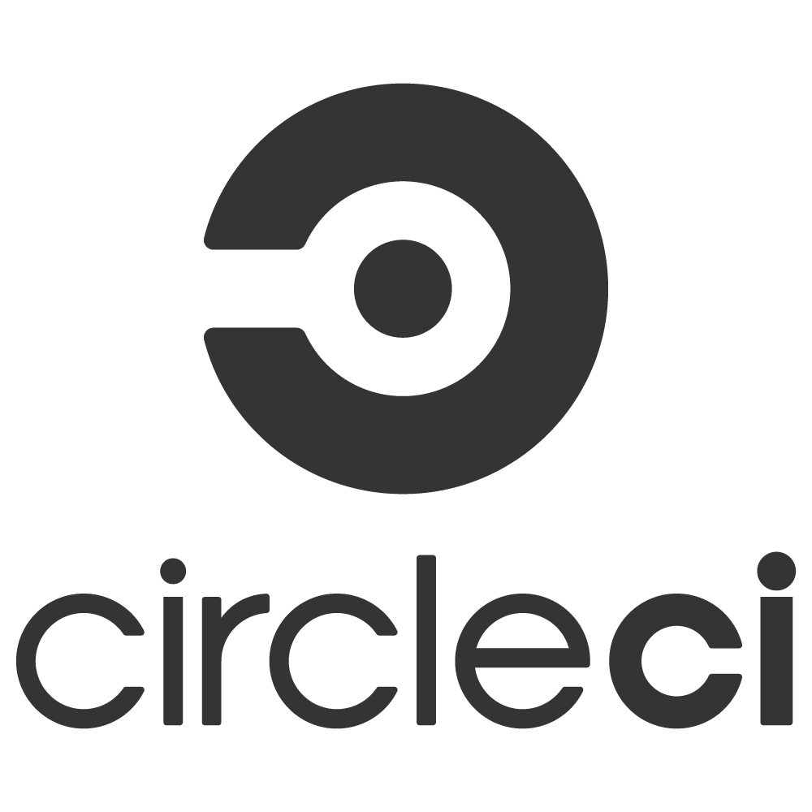

<h1 align="center">CircleCI Practice</h1>

[CircleCI](https://circleci.com/ "CircleCI website") is a `developer-centric`
**continuous integration** and **continuous delivery** platform that enables software teams to `build`,
`test`, and `deploy` with confidence.

CircleCI is the first `modern CI platform` to deliver `pipelines as code`, enabling
teams to **version control** their `build processes` **alongside their code**.

This repository contains a CircleCI configuration file to practice
Continuous Integration using CircleCI as well as to complete exercises
from Udacity's Cloud DevOps Engineer Nanodegree.
